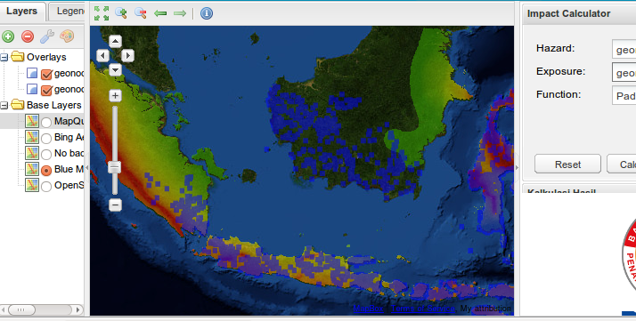

.. _index:

.. image:: http://riskinabox.org/media/riab-logo.png
	:scale: 50 %
	:align: center

======================
Risiko's documentation
======================

.. rubric:: Risiko is a web based tool that models impacts of different hazard events on population or infrastructure. It is part of a set of Open Source Software tools called Risk in a Box, and we encourage you to build new applications using its components and the resources it provides. The project home page can be found at http://riskinabox.org/

        
        Risiko Screenshot showing earthquake hazard in Indonesia

=============================
Introduction and Installation
=============================

.. toctree::
   :maxdepth: 3
   :numbered:

   intro/basic_install
   intro/faq
   
===========
Usage Guide
===========

.. toctree::
   :maxdepth: 3
   :numbered:

   usage/overview
   usage/risiko_calculator
   usage/plugins/development
   
   
===============
Developer Guide
===============

.. toctree::
   :maxdepth: 3
   :numbered:

   development/overview
   development/architecture
   development/pluginmanager
   development/documentation
   development/contributing
   development/release-process
   development/git
   development/dev_help

===========================
Production Deployment Guide
===========================

.. toctree::
   :maxdepth: 3
   :numbered:

   deployment/production_install
   

